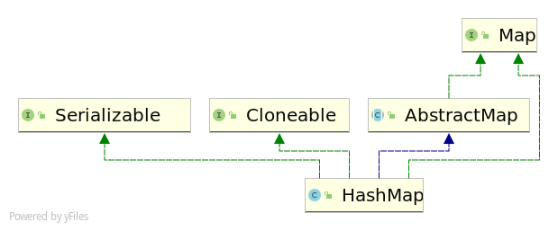

# HashMap简介

> 这个笔记主要针对JDK1.8。

 HashMap主要用于存储键值对，是java常用的集合之一。

HashMap由数组(桶)+链表(节点)组成。

> 每个节点通过相应的计算放在相应的桶中。

当链表中的长度大于阀值时，会转换成红黑树，以减少搜索时间。

> 阀值的默认值为8，将链表转换成红黑树之前会判断，如果当数组的长度小于64，那么会优先对数组进行扩容，而不是红黑树。



# 集合底层数据结构分析

> HashMap中的Key通过扰动hashCode获得扰动后的hash值，然后通过 `(n - 1) & hash` 判断当前元素存放的位置（这里的 n 指的是有多少个桶，也就是数组的长度），如果该位置有元素，就判断hash的值是否与key的值相同，如果相同就直接覆盖，不相同就通过拉链法解决冲突。

**拉链法解决冲突：由于HashMap是采用数组加链表组成，意思就是数组就是0～n个桶，桶里装的就是一个链表，拉链解决冲突仅仅就是，hash值一样(表示都应该放在一个桶里)，然后在链表的某位追加，并不是很神奇的一个东西。**

在1.8版本中，当链表的长度大于阀值的时候(默认是8),就会将链表转换为红黑树，为了减少搜索时间。为了方便理解，后面会将桶中存储的数据统一称为节点。

## 扰动方法

> 扰动方法是HashMap中的hash方法，hash是为了防止某些表现得比较差的hashCode()方法，为了减少碰撞。

```java
static final int hash(Object key) {
    int h;
    // ^ ：按位异或
    // >>>:无符号右移，忽略符号位，空位都以0补齐
    return (key == null) ? 0 : (h = key.hashCode()) ^ (h >>> 16);
}
```

## 链表和红黑树源码

链表

```java
static class Node<K,V> implements Map.Entry<K,V> {
    //哈希值，存放元素到hashmap中时用来与其他元素hash值比较
    final int hash;
    final K key;
    V value;
    //指向下一个链表节点   由此可见，这是一个单向链表ss	
    Node<K,V> next;

    Node(int hash, K key, V value, Node<K,V> next) {
        this.hash = hash;
        this.key = key;
        this.value = value;
        this.next = next;
    }

    public final K getKey()        { return key; }
    public final V getValue()      { return value; }
    public final String toString() { return key + "=" + value; }
	//重写hashCode方法
    public final int hashCode() {
        return Objects.hashCode(key) ^ Objects.hashCode(value);
    }

    public final V setValue(V newValue) {
        V oldValue = value;
        value = newValue;
        return oldValue;
    }
	//重写equals方法
    public final boolean equals(Object o) {
        if (o == this)
            return true;
        if (o instanceof Map.Entry) {
            Map.Entry<?,?> e = (Map.Entry<?,?>)o;
            if (Objects.equals(key, e.getKey()) &&
                Objects.equals(value, e.getValue()))
                return true;
        }
        return false;
    }
}
```

红黑树

```java
static final class TreeNode<K,V> extends LinkedHashMap.Entry<K,V> {
    TreeNode<K,V> parent;  // red-black tree links
    TreeNode<K,V> left;
    TreeNode<K,V> right;
    TreeNode<K,V> prev;    // needed to unlink next upon deletion
    boolean red;
    TreeNode(int hash, K key, V val, Node<K,V> next) {
        super(hash, key, val, next);
    }

    //返回根节点
    final TreeNode<K,V> root() {
        for (TreeNode<K,V> r = this, p;;) {
            if ((p = r.parent) == null)
                return r;
            r = p;
        }
    }
}
```

# 源码

## 构造方法

```java
public HashMap(int initialCapacity, float loadFactor) {//指定容量大小和和因子
    if (initialCapacity < 0)
        throw new IllegalArgumentException("Illegal initial capacity: " +
                                           initialCapacity);
    if (initialCapacity > MAXIMUM_CAPACITY)
        initialCapacity = MAXIMUM_CAPACITY;
    if (loadFactor <= 0 || Float.isNaN(loadFactor))
        throw new IllegalArgumentException("Illegal load factor: " +
                                           loadFactor);
    this.loadFactor = loadFactor;
    this.threshold = tableSizeFor(initialCapacity);
}

/**
 * Constructs an empty <tt>HashMap</tt> with the specified initial
 * capacity and the default load factor (0.75).
 *
 * @param  initialCapacity the initial capacity.
 * @throws IllegalArgumentException if the initial capacity is negative.
 */
public HashMap(int initialCapacity) {//指定容量大小
    this(initialCapacity, DEFAULT_LOAD_FACTOR);
}

/**
 * Constructs an empty <tt>HashMap</tt> with the default initial capacity
 * (16) and the default load factor (0.75).
 */
public HashMap() {
    this.loadFactor = DEFAULT_LOAD_FACTOR; // all other fields defaulted
}

/**
 * Constructs a new <tt>HashMap</tt> with the same mappings as the
 * specified <tt>Map</tt>.  The <tt>HashMap</tt> is created with
 * default load factor (0.75) and an initial capacity sufficient to
 * hold the mappings in the specified <tt>Map</tt>.
 *
 * @param   m the map whose mappings are to be placed in this map
 * @throws  NullPointerException if the specified map is null
 */
public HashMap(Map<? extends K, ? extends V> m) {//包含另外一个Map的构造函数
    this.loadFactor = DEFAULT_LOAD_FACTOR;
    putMapEntries(m, false);
}
```

`putMapEntries`方法用于添加map到本类

```java
/**
 * Implements Map.putAll and Map constructor.
 *
 * @param m the map
 * @param evict false when initially constructing this map, else
 * true (relayed to method afterNodeInsertion).
 */
final void putMapEntries(Map<? extends K, ? extends V> m, boolean evict) {
    int s = m.size();
    if (s > 0) {
        if (table == null) { // pre-size
            float ft = ((float)s / loadFactor) + 1.0F;
            int t = ((ft < (float)MAXIMUM_CAPACITY) ?
                     (int)ft : MAXIMUM_CAPACITY);
            if (t > threshold)
                threshold = tableSizeFor(t);
        }
        else if (s > threshold)
            resize();
        for (Map.Entry<? extends K, ? extends V> e : m.entrySet()) {
            K key = e.getKey();
            V value = e.getValue();
            putVal(hash(key), key, value, false, evict);
        }
    }
}
```

## 类的属性

- **loadFactor加载因子**

  loadFactor加载因子是控制数组存放数据的疏密程度，loadFactor越趋近于1，那么   数组中存放的数据(entry)也就越多，也就越密，也就是会让链表的长度增加，loadFactor越小，也就是趋近于0，数组中存放的数据(entry)也就越少，也就越稀疏。

  **loadFactor太大导致查找元素效率低，太小导致数组的利用率低，存放的数据会很分散。loadFactor的默认值为0.75f是官方给出的一个比较好的临界值**。 

  给定的默认容量为 16，负载因子为 0.75。Map 在使用过程中不断的往里面存放数据，当数量达到了 16 * 0.75 = 12 就需要将当前 16 的容量进行扩容，而扩容这个过程涉及到 rehash、复制数据等操作，所以非常消耗性能。

- **threshold**

  **threshold = capacity * loadFactor**，**当Size>=threshold**的时候，那么就要考虑对数组的扩增了，也就是说，这个的意思就是 **衡量数组是否需要扩增的一个标准**。

```java
public class HashMap<K,V> extends AbstractMap<K,V> implements Map<K,V>, Cloneable, Serializable {
    // 序列号
    private static final long serialVersionUID = 362498820763181265L;    
    // 默认的初始容量是16 相当于2的4次方
    static final int DEFAULT_INITIAL_CAPACITY = 1 << 4;   
    // 最大容量
    static final int MAXIMUM_CAPACITY = 1 << 30; 
    // 默认的填充因子
    static final float DEFAULT_LOAD_FACTOR = 0.75f;
    // 当桶(bucket)上的结点数大于这个值时会转成红黑树
    static final int TREEIFY_THRESHOLD = 8; 
    // 当桶(bucket)上的结点数小于这个值时树转链表
    static final int UNTREEIFY_THRESHOLD = 6;
    // 桶中结构转化为红黑树对应的table的最小大小
    static final int MIN_TREEIFY_CAPACITY = 64;
    // 存储元素的数组，总是2的幂次倍
    transient Node<k,v>[] table; 
    // 存放具体元素的集
    transient Set<map.entry<k,v>> entrySet;
    // 存放元素的个数，注意这个不等于数组的长度。
    transient int size;
    // 每次扩容和更改map结构的计数器
    transient int modCount;   
    // 临界值 当实际大小(容量*填充因子)超过临界值时，会进行扩容
    int threshold;
    // 加载因子
    final float loadFactor;
}
```

## put方法

```java
public V put(K key, V value) {
    return putVal(hash(key), key, value, false, true);
}
```

从源码可以看出该方法会调用`putVal`方法添加元素

1. 添加元素时会先判断需不需要初始化。
2. 计算到桶的位置后，桶中有没有节点，没有就创建一个新节点（链表节点）
3. 如果桶中存在元素，就判断是否与第一个相等，相等就替换，不相等就判断是否为红黑树，如果是红黑树就添加到红黑树中。如果是链表就追加到末尾，再判断是否需要转换成红黑树

```java
final V putVal(int hash, K key, V value, boolean onlyIfAbsent,
               boolean evict) {
    Node<K,V>[] tab; Node<K,V> p; int n, i;
    //当table（也就是桶）未初始话的时候会调用resize方法进行扩容
    if ((tab = table) == null || (n = tab.length) == 0)
        n = (tab = resize()).length;
    //判断桶中有没有元素，如果没有，创建一个新节点，并放到桶中
    if ((p = tab[i = (n - 1) & hash]) == null)
        tab[i] = newNode(hash, key, value, null);
    //桶中存在元素
    else {
        Node<K,V> e; K k;
        //判断桶中第一个元素hash相等，key相等
        if (p.hash == hash &&
            ((k = p.key) == key || (key != null && key.equals(k))))
            //将第一个元素赋值给e
            e = p;
        //判断是否为树节点
        else if (p instanceof TreeNode)
            //添加到树中
            e = ((TreeNode<K,V>)p).putTreeVal(this, tab, hash, key, value);
        //为链表节点
        else {
            //追加到末尾 
            for (int binCount = 0; ; ++binCount) {
                if ((e = p.next) == null) {
                    p.next = newNode(hash, key, value, null);
                    if (binCount >= TREEIFY_THRESHOLD - 1) // -1 for 1st
                        treeifyBin(tab, hash);
                    break;
                }
                if (e.hash == hash &&
                    ((k = e.key) == key || (key != null && key.equals(k))))
                    break;
                p = e;
            }
        }
        //不为空表示在桶中节点找到了对应的key
        if (e != null) { // existing mapping for key
            V oldValue = e.value;
            if (!onlyIfAbsent || oldValue == null)
                //替换新值
                e.value = value;
            afterNodeAccess(e);
            //返回旧值
            return oldValue;
        }
    }
    //做了结构修改
    ++modCount;
    //如果实际大小大于阀值，就进行扩容
    if (++size > threshold)
        resize();
    afterNodeInsertion(evict);
    return null;
}
```

## get 方法

内部会调用`getNode`方法来获取元素

```java
public V get(Object key) {
    Node<K,V> e;
    return (e = getNode(hash(key), key)) == null ? null : e.value;
}
```

`getNode`

```java
final Node<K,V> getNode(int hash, Object key) {
    Node<K,V>[] tab; Node<K,V> first, e; int n; K k;
    //判断该Map不为空
    if ((tab = table) != null && (n = tab.length) > 0 &&
        //通过hash找到对应的桶中的节点
        (first = tab[(n - 1) & hash]) != null) {
        //hash相同或者key相同，返回first（第一个元素）
        if (first.hash == hash && // always check first node
            ((k = first.key) == key || (key != null && key.equals(k))))
            return first;
        //桶中节点大于1
        if ((e = first.next) != null) {
            //如果是树节点就搜索找到对应的V
            if (first instanceof TreeNode)
                return ((TreeNode<K,V>)first).getTreeNode(hash, key);
            //不是树节点就循环找到对应的V
            do {
                if (e.hash == hash &&
                    ((k = e.key) == key || (key != null && key.equals(k))))
                    return e;
            } while ((e = e.next) != null);
        }
    }
    return null;
}

```

## resize

用于给HashMap扩容

```java
final Node<K,V>[] resize() {
    Node<K,V>[] oldTab = table;
    int oldCap = (oldTab == null) ? 0 : oldTab.length;
    int oldThr = threshold;
    int newCap, newThr = 0;
    if (oldCap > 0) {
        //超过了最大值就不会扩容了，任由你碰撞 最大值是2的30次方
        if (oldCap >= MAXIMUM_CAPACITY) {
            threshold = Integer.MAX_VALUE;
            return oldTab;
        }
        //没超过最大值就扩容至原来的两倍
        else if ((newCap = oldCap << 1) < MAXIMUM_CAPACITY &&
                 oldCap >= DEFAULT_INITIAL_CAPACITY)
            newThr = oldThr << 1; // double threshold
    }
    else if (oldThr > 0) // initial capacity was placed in threshold
        newCap = oldThr;
    else {               // zero initial threshold signifies using defaults
        newCap = DEFAULT_INITIAL_CAPACITY;
        newThr = (int)(DEFAULT_LOAD_FACTOR * DEFAULT_INITIAL_CAPACITY);
    }
    if (newThr == 0) {
        float ft = (float)newCap * loadFactor;
        newThr = (newCap < MAXIMUM_CAPACITY && ft < (float)MAXIMUM_CAPACITY ?
                  (int)ft : Integer.MAX_VALUE);
    }
    threshold = newThr;
    @SuppressWarnings({"rawtypes","unchecked"})
    Node<K,V>[] newTab = (Node<K,V>[])new Node[newCap];
    table = newTab;
    //扩容结束后会重新计算各个hash值，重新放到相应的桶中,由此可见，hashmap扩容是相当耗时的
    if (oldTab != null) {
        for (int j = 0; j < oldCap; ++j) {
            Node<K,V> e;
            if ((e = oldTab[j]) != null) {
                oldTab[j] = null;
                if (e.next == null)
                    newTab[e.hash & (newCap - 1)] = e;
                else if (e instanceof TreeNode)
                    ((TreeNode<K,V>)e).split(this, newTab, j, oldCap);
                else { // preserve order
                    Node<K,V> loHead = null, loTail = null;
                    Node<K,V> hiHead = null, hiTail = null;
                    Node<K,V> next;
                    do {
                        next = e.next;
                        if ((e.hash & oldCap) == 0) {
                            if (loTail == null)
                                loHead = e;
                            else
                                loTail.next = e;
                            loTail = e;
                        }
                        else {
                            if (hiTail == null)
                                hiHead = e;
                            else
                                hiTail.next = e;
                            hiTail = e;
                        }
                    } while ((e = next) != null);
                    if (loTail != null) {
                        loTail.next = null;
                        newTab[j] = loHead;
                    }
                    if (hiTail != null) {
                        hiTail.next = null;
                        newTab[j + oldCap] = hiHead;
                    }
                }
            }
        }
    }
    return newTab;
}
```

