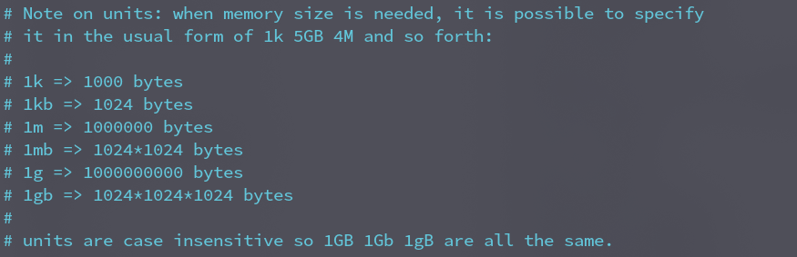
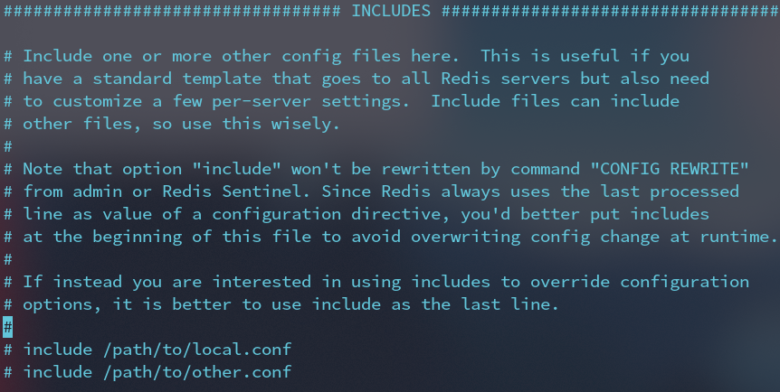
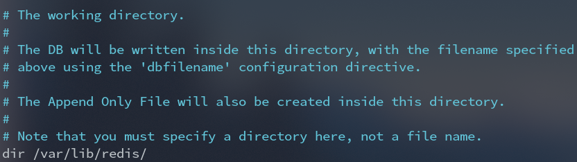
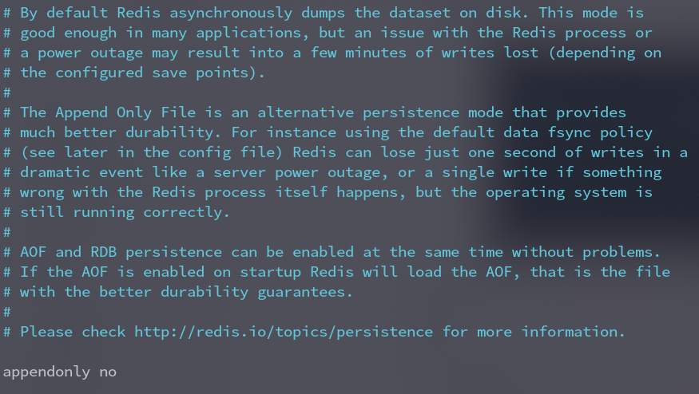
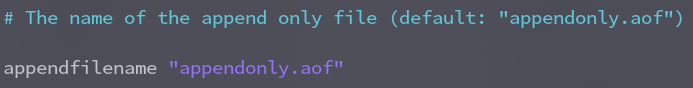
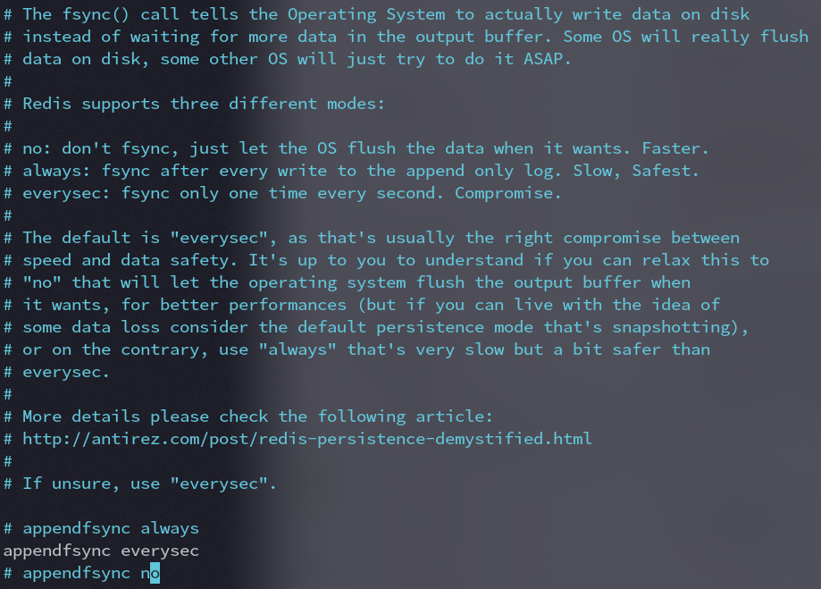
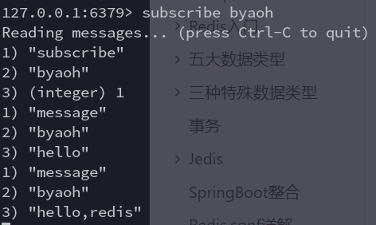
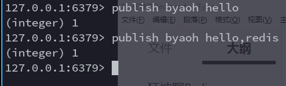
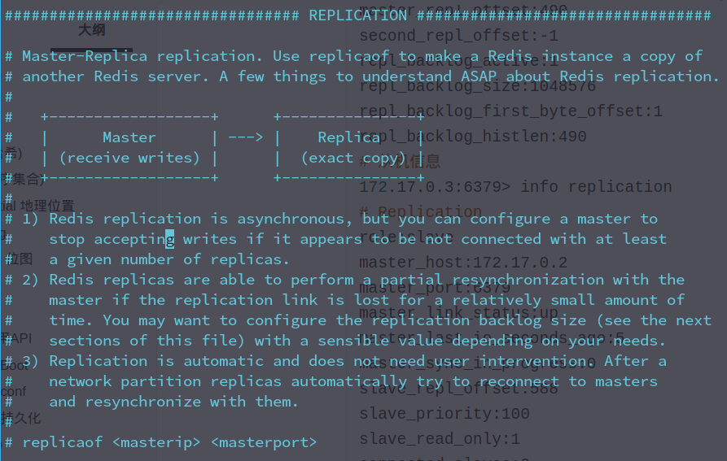

# 1. String

- `select 0`  切换到0数据库
- `exists key` 判断是否存在该`key`

- `set key value` 设置一个键值对
- `setrange key offset value` 替换字符串 从`offset` 替换成 `value`
- `append key ` 追加数据
- `strlen key` 获取长度
- `get key `  获取一个 key
- `getrange key1 start  end` 截取字符串 
- `incr key`  自增1
- `decr key`  自减1
- `incrby key 10` 自增10
- `decrby key 10` 自减10

- `setex key seconds value`
  - seconds 过期时间
  - value 设置的值
- `ttl key` 查看该key过期时间
- `setnx key value` 当 `key` 不存在时创建
- `mset key value [key value ... ]`批量创建
- `mget key [key ...]` 批量获取
- `msetnx key value [key value ...]` 批量创建 **不存在时创建，保证原子性，要么都成功，要么都失败**
- `getset key value` 先get `key` 再set `value`

---

# 2. List

> 基本和string 一样 命令以 l开头

- `lpush key value ...` 从顶部插数据

```bash
127.0.0.1:6379> LPUSH list 1
127.0.0.1:6379> LPUSH list 2
127.0.0.1:6379> LPUSH list 3 4 5 6 7 8 9
127.0.0.1:6379> LRANGE list 0 -1
1) "9"
2) "8"
3) "7"
4) "6"
5) "5"
6) "4"
7) "3"
8) "2"
9) "1"
```

- `rpush key value ...` 从末尾添加数据

- `lpop key` 从顶部移除数据
- `rpop key` 从尾部移除数据

- `lrem key count element` 移除指定的值
  - `count` 指定数量
  - `element`指定值
- `ltrim key start stop` 通过下标截取指定的长度
  - `start` 起始下标(包含)
  - `stop` 结束下标(包含)

```bash
127.0.0.1:6379> LRANGE list 0 -1
 1) "1" #0
 2) "2" #1
 3) "3" #2
 4) "4" #3
 5) "5" #4
 6) "6" #5
 7) "7" #6
 8) "8" #7
 9) "9" #8
10) "10"#9
127.0.0.1:6379> LTRIM list 4 8
OK
127.0.0.1:6379> LRANGE list 0 -1
1) "5"
2) "6"
3) "7"
4) "8"
5) "9"
```

- `rpoplpush source destination` 移出尾部元素到 `destination`

- `lset key index element` 更新list指定下标的值(**如果不存在会报错**)
- `linsert key before|after pivot element` 将一个值插入到某个值的前面 或者后面
  - `before|after` 插到它的前面或者后面
  - `pivot` 某个具体的值
  - `element` 要插入的值

> 类似链表， 栈 ，队列

# 3. Set

set中的值是不能重复的

> 命令以 s 开头 

- `sadd key member ...` 向 key 中添加值
- `smembers key` 查看指定set中的所有值
- `sismember key member` 判断指定值是否在set集合中
- `scard myset` 获取set集合中元素的个数
- `srem key member...` 移除set集合中的元素
- `srandmember key count`随机抽选 `count` 个元素
- `spop key count` 随机移除`count` 个元素
- `smove source destination member` 移动元素
  - `source`源set集合
  - `destination` 目标集合
  - `member` 指定元素
- `sdiff key [key...]` 差集(他没有的元素)
- `sinter key [key...]` 交集
- `sunion key [key...]` 并集
```bash
127.0.0.1:6379> SMEMBERS key1
1) "a"
2) "c"
3) "b"
127.0.0.1:6379> SMEMBERS key2
1) "d"
2) "c"
3) "e"
127.0.0.1:6379> sdiff key1 key2
1) "a"
2) "b"
127.0.0.1:6379> sinter key1 key2
1) "c"
127.0.0.1:6379> sunion key1 key2
1) "c"
2) "b"
3) "a"
4) "d"
5) "e"
```

# 4. Hash(哈希)

> Map集合, key-Map 值相当于Map 命令以h开头

- `hget hset hmset` 用法和上面一样
- `hgetall key ` 获取所有值
- `hdel key field...` 删除指定key字段
- `hlen key` 获取长度
- `hexists key field` 判断hash中某个 key是否存在
- `hkeys key` 获取hash中所有key
- `hvals key` 获取hash中所有value
- `hincrby  key filed` 使用和上面一样

# 5. Zset(有序集合)

> 和set一样 只是多了排序 命令以z 开头

- `zadd key `
- `zrangebyscore key` 默认从小到大

```bash
127.0.0.1:6379> ZRANGEBYSCORE salary -inf +inf withscores
1) "byaoh"
2) "500"
3) "xiaohong"
4) "2500"
5) "zhangsan"
6) "5000"
127.0.0.1:6379> ZRANGEBYSCORE salary -inf 2500 withscores
1) "byaoh"
2) "500"
3) "xiaohong"
4) "2500"
```

- `zrevrange key ` 从大到小排序
- `zrem key member...` 移除元素
- `zcard key` 获取集合中的个数
- `zcount key min max ` 获取指定区间的成员数量

# 6. [geospatial 地理位置](http://www.redis.cn/commands/geoadd.html)

- `geoadd key 维度 经度 值` 添加地理位置 

```bash
127.0.0.1:6379> geoadd china:city 116.40 39.90 beijin
(integer) 1
127.0.0.1:6379> geoadd china:city 121.47 31.23 shanghai
(integer) 1
127.0.0.1:6379> geoadd china:city 106.50 29.53 chongqin
(integer) 1
127.0.0.1:6379> geoadd china:city 114.05 22.52 shengzhen
(integer) 1
127.0.0.1:6379> geoadd china:city 120.16 30.24  hangzhou
(integer) 1
127.0.0.1:6379> geoadd china:city 108.96 34.26  xian
(integer) 1
127.0.0.1:6379> 

```

- `geopos key 值` 获取key中的地理位置

- `geodist key 值 值 [m|km|ft|mi]` 两个位置的距离

  - **m** 表示单位为米。
  - **km** 表示单位为千米。
  - **mi** 表示单位为英里。
  - **ft** 表示单位为英尺。

- `georadius key longitude(经度) latitude(维度) radius(距离) m|km|ft|mi(单位) [WITHCOORD](显示条件...) [WITHDIST] [WITHHASH]`

  以给定的经纬度为中心， 返回键包含的位置元素当中， 与中心的距离不超过给定最大距离的所有位置元素。

- `georadiusbymember key 值 radius(距离) m|km|ft|mi(单位) [WITHCOORD](显示条件...) [WITHDIST] [WITHHASH]  ` 

  这个命令和 [GEORADIUS](http://www.redis.cn/commands/georadius.html) 命令一样， 都可以找出位于指定范围内的元素， 但是 `GEORADIUSBYMEMBER` 的中心点是由给定的位置元素决定的， 而不是像 [GEORADIUS](http://www.redis.cn/commands/georadius.html) 那样， 使用输入的经度和纬度来决定中心点

  指定成员的位置被用作查询的中心。

- `geohash key member...`

  该命令将返回11个字符的Geohash字符串

- `zrem ` 可以移除指定元素

- `zrange key ` 查看全部元素

# 7. hyperlog

类似与set集合 专门统计不重复数量(相当于基数)

- `pfadd` 添加
- `pfcount` 计数
- `pfmerge`合并

```bash
127.0.0.1:6379> pfadd mykey 1 2 3 4 5 6 7 8 9 10
(integer) 1
127.0.0.1:6379> PFCOUNT mykey
(integer) 10
127.0.0.1:6379> pfadd mykey2 5 6 7 8 9 10 11 12 13 14 15
(integer) 1
127.0.0.1:6379> pfmerge mykey3 mykey mykey2
OK
127.0.0.1:6379> pfcount mykey3
(integer) 15
127.0.0.1:6379> 
```


# 8. bitmaps 位图 

- `setbit getbit` 

```bash
127.0.0.1:6379> setbit test 0 1 
(integer) 0
127.0.0.1:6379> setbit test 1 1
(integer) 0
127.0.0.1:6379> setbit test 2 0
(integer) 0
127.0.0.1:6379> getbit test 0
(integer) 1
```

- `bitcount` 统计为1的数量

# 9. 事务

> 一次性 顺序性 排他性
>
> redis事务没有隔离级别的概念

- 开启事务 `multi`
- 命令入队
- 执行事务`exec`

---

- 放弃事务`discard`

> 监控 watch 
>
> 受监控的值在事务提交前被修改会直接失败

```bash
127.0.0.1:6379> set money 100
OK
127.0.0.1:6379> set out 0
OK
127.0.0.1:6379> watch money 
OK
127.0.0.1:6379> MULTI
OK
127.0.0.1:6379> DECRBY money 20
QUEUED
127.0.0.1:6379> INCRBY out 20
QUEUED
127.0.0.1:6379> exec
1) (integer) 80
2) (integer) 20
```

# 10. Jedis

> java操作redis的中间件

1. 导入依赖

```xml
<!-- https://mvnrepository.com/artifact/redis.clients/jedis -->
<dependency>
    <groupId>redis.clients</groupId>
    <artifactId>jedis</artifactId>
    <version>3.4.1</version>
</dependency>
```

2. 连接测试

```java
Jedis jedis = new Jedis("127.0.0.1", 6379);
System.out.println(jedis.ping());
```

## 10.1 常用API

> 和命令使用的一模一样

# 11. SpringBoot

1. 导入依赖

```xml
<dependency>
    <groupId>org.springframework.boot</groupId>
    <artifactId>spring-boot-starter-data-redis</artifactId>
</dependency>
```

2. 配置连接

```yaml
spring:
  redis:
    host: 127.0.0.1
    port: 6379
    lettuce:
```

3. 测试连接

```java
@Autowired
private RedisTemplate redisTemplate;
```

---

自定义`redisTemplate`

```java
@Bean
@SuppressWarnings("all")
public RedisTemplate<String, Object> redisTemplate(RedisConnectionFactory redisConnectionFactory) {
    RedisTemplate<String, Object> template = new RedisTemplate<>();
    template.setConnectionFactory(redisConnectionFactory);
    //        json序列化配置
    Jackson2JsonRedisSerializer jackson2JsonRedisSerializer = new Jackson2JsonRedisSerializer(Object.class);
    ObjectMapper om = new ObjectMapper();
    om.setVisibility(PropertyAccessor.ALL, JsonAutoDetect.Visibility.ANY);
    om.enableDefaultTyping(ObjectMapper.DefaultTyping.NON_FINAL);
    jackson2JsonRedisSerializer.setObjectMapper(om);
    //String
    StringRedisSerializer stringRedisSerializer = new StringRedisSerializer();
    template.setKeySerializer(stringRedisSerializer);
    //        hashKey
    template.setHashKeySerializer(stringRedisSerializer);
    //        value
    template.setValueSerializer(jackson2JsonRedisSerializer);
    //        hashValue
    template.setHashValueSerializer(jackson2JsonRedisSerializer);
    template.afterPropertiesSet();
    return template;
}
```

# 12. Redis.conf

> 单位



配置文件对大小写不敏感

> 可以配置多个配置文件



> 网络

```bash
bind 127.0.0.1 # 只允许指定的ip访问
protected-mode yes # 开启安全模式
port 6379 # 端口号
```

> 通用配置

```bash
daemonize no # 以守护进程方式运行
pidfile /var/run/redis_6379.pid # 以后台的方式允许指定的配置文件
# 日志
# Specify the server verbosity level.
# This can be one of:
# debug (a lot of information, useful for development/testing)
# verbose (many rarely useful info, but not a mess like the debug level)
# notice (moderately verbose, what you want in production probably)
# warning (only very important / critical messages are logged)
loglevel notice
logfile "" # 日志的路径
databases 16 # 数据库的数量
always-show-logo yes # 是否总是显示logo

```

> 快照

持久化, 在规定的时间内，执行了多少次操作，则会持久化到文件 .rdb .aof

由于redis是内存数据库，如果没有持久化，那么数据断电即失!

```bash
# 900 秒内，如果至少有 1 个key进行了修改，进行持久化操作
save 900 1
# 300 秒内，如果至少有 10 个key进行了修改，进行持久化操作
save 300 10
save 60 10000

stop-writes-on-bgsave-error yes # 持久化出错了 是否持续工作
rdbcompression yes # 是否压缩 rdb 文件，需要消耗cpu资源
rdbchecksum yes # 保存rdb文件的时候，进行错误的校验
dir /var/lib/redis/ # rdb 文件保存的目录
```

> *REPLICATION* 复制 主从复制

> *SECURITY* 安全

可以用该命令设置密码 `config set requirepass "123456"`

`auth` 登陆

> clients

```bash
maxclients 10000 # 设置最大连接数量 最大redis的客户端链接数量

maxmemory <bytes> # 最大内存限制

maxmemory-policy noeviction # 内存达到上限之后的处理策略
######################################################################
#1、volatile-lru：只对设置了过期时间的key进行LRU（默认值） 
#
#2、allkeys-lru ： 删除lru算法的key   
#
#3、volatile-random：随机删除即将过期key   
#
#4、allkeys-random：随机删除   
#
#5、volatile-ttl ： 删除即将过期的   
#
#6、noeviction ： 永不过期，返回错误
######################################################################
```

> *APPEND ONLY MODE* 模式 aof 配置

```bash
appendonly no # 默认不开启aof 默认是使用rdb方式持久化， 大部分情况rdb够用
appendfilename "appendonly.aof" # 持久化文件名
# appendfsync always # 每次修改都同步,消耗性能
appendfsync everysec # 每秒都同步一次，可能会丢失这1s的数据
# appendfsync no	 # 不执行同步， 操作系统自己同步数据，速度最快
```

# 13. Redis 持久化

## 13.1 rdb

> rdb默认会开启一个子进程专注进行持久化操作

**rdb保存的文件名是dump.rdb**在配置文件中的快照进行配置


**rdb默认保存的目录是**



若要恢复备份只需将dump.rdb文件复制到默认目录即可

**缺点** 

由于操作需要一定时间间隔，如果redis意外宕机了，最后一次修改的数据就没有了

## 13.2 aof

> aof以日志的形式记录每个写操作，将每个命令追加到文件中，数据一多，恢复的时候效率就会变得很低，因为他会重新执行命令

开启aof **默认是不开启的** 如果要使用 将`no`改为`yes`即可



**aof保存文件名是appendonly.aof**



如果appendonly.aof文件被人篡改 可以使用 redis--check-aof --fix `路径` 来修复

> 优点和缺点



**优点:**

1. 每次修改都同步,文件完整会更加好
2. 每秒同步一次,可能会丢失一秒数据
3. 从不同步,效率最高

**缺点:**

1. 相对于数据文件来说，aof远远大于rdb,修复速度也比rdb慢
2. aof运行效率也比rdb慢

# 14. Redis发布订阅

## 14.1 Redis发布订阅

1. 订阅一个或多个符合给定的频道

`subscribe pattern...`

2. 查看订阅于发布系统状态

`pubsub subcommand [argument ...]`

3. 将信息发送到指定的频道

`publish channel message`

订阅端:



发送端:



原理:

每一个频道相当于一个kv键值对，v就是一个链表，记录着每个订阅者，发送者发送的时候会遍历这个链表，将消息发布给所有订阅者。

使用场景:

1. 实时消息系统
2. 实时聊天(类似群聊)
3. 订阅关注系统

复杂场景我们会使用消息中间件MQ

## 14.2 主从复制

> 数据复制是单向的，只能由主节点到从节点，主机以写为主，从机以读为主
>
> 默认情况下，每个redis服务器都是主节点

### 14.2.1 测试环境配置

> 只配置从库

```bash
127.0.0.1:6379> info replication # 查看当前库信息
# Replication
role:master
connected_slaves:0
master_replid:77d4a85be8244445b2fc1cd00a0a72571c30dcb2
master_replid2:0000000000000000000000000000000000000000
master_repl_offset:0
second_repl_offset:-1
repl_backlog_active:0
repl_backlog_size:1048576
repl_backlog_first_byte_offset:0
repl_backlog_histlen:0
```

集群环境配置

```bash
# 主机
docker run -p 6379:6379 --name redis79 -v /home/l/etc/redis.conf:/etc/redis.conf -v /home/l/etc/redis/data/79:/data -d redis redis-server /etc/redis.conf
# 从机
docker run -p 6380:6379 --name redis80 -v /home/l/etc/redis.conf:/etc/redis.conf -v /home/l/etc/redis/data/80:/data -d redis redis-server /etc/redis.conf

# 从机
docker run -p 6381:6379 --name redis81 -v /home/l/etc/redis.conf:/etc/redis.conf -v /home/l/etc/redis/data/81:/data -d redis redis-server /etc/redis.conf

```

 从机配置

> `slaveof` 认老大(设定主机)

```bash
# 先使用 docker inspect redis79 查看主机ip
redis-cli -h 172.17.0.3 -p 6379 # 进入redis从机
172.17.0.3:6379> slaveof 172.17.0.2 6379
OK

redis-cli -h 172.17.0.4 -p 6379 # 进入redis从机
172.17.0.4:6379> slaveof 172.17.0.2 6379
OK Already connected to specified master

172.17.0.2:6379> info replication # 查看主机库信息
# Replication
role:master
connected_slaves:2
slave0:ip=172.17.0.4,port=6379,state=online,offset=490,lag=0
slave1:ip=172.17.0.3,port=6379,state=online,offset=490,lag=0
master_replid:7262f0b9323a6d45607e36aa3a0f7df6b08aa44d
master_replid2:0000000000000000000000000000000000000000
master_repl_offset:490
second_repl_offset:-1
repl_backlog_active:1
repl_backlog_size:1048576
repl_backlog_first_byte_offset:1
repl_backlog_histlen:490
# 从机信息
172.17.0.3:6379> info replication
# Replication
role:slave
master_host:172.17.0.2
master_port:6379
master_link_status:up
master_last_io_seconds_ago:5
master_sync_in_progress:0
slave_repl_offset:588
slave_priority:100
slave_read_only:1
connected_slaves:0
master_replid:7262f0b9323a6d45607e36aa3a0f7df6b08aa44d
master_replid2:0000000000000000000000000000000000000000
master_repl_offset:588
second_repl_offset:-1
repl_backlog_active:1
repl_backlog_size:1048576
repl_backlog_first_byte_offset:15
repl_backlog_histlen:574
```

这种配置属于命令配置，可以使用配置文件配置 **不使用配置文件宕机了需要重新配置**



## 14.1.3 redis缓存穿透和雪崩

`slaveof no one`当主机宕机以后可以用这个命令让自己成为主节点,其他节点可以手动连接到最新的这个主节点，这个时候老主机连接回来了，也手动成为新主机的从机

### 14.1.3.1 哨兵模式

> 自动选主机的模式

哨兵会检测主服务器是否宕机，如果主服务器宕机，会通过投票的方式来选择新主机，然后通过发布订阅模式让各个哨兵把自己监控的从服务器切换到主机

> 测试

现在测试环境是一主二从

1. 编写配置文件`sentinel.conf`

```bash
# sentinel monitor myredis （被监控的主机名称） host port 1 数字1 代表主机挂了，slave投票看让谁接替成为新主机，票最多的，成为新主机
sentinel monitor myredis 127.17.0.2 6379 1
```

启动哨兵

```shell
┌─(~)───────────────────────────────────────────────────────────────────────────────────────────────────────────────────────────────────────────────────────────────────────────────────────(l@ByaoH:pts/5)─┐
└─(11:03:56)──> redis-sentinel etc/redis/sentinel.conf                                                                                                                                         ──(三,2月10)─┘
12237:X 10 Feb 2021 11:04:13.140 # oO0OoO0OoO0Oo Redis is starting oO0OoO0OoO0Oo
12237:X 10 Feb 2021 11:04:13.140 # Redis version=6.0.10, bits=64, commit=00000000, modified=0, pid=12237, just started
12237:X 10 Feb 2021 11:04:13.140 # Configuration loaded
12237:X 10 Feb 2021 11:04:13.140 * Increased maximum number of open files to 10032 (it was originally set to 1024).
                _._                                                  
           _.-``__ ''-._                                             
      _.-``    `.  `_.  ''-._           Redis 6.0.10 (00000000/0) 64 bit
  .-`` .-```.  ```\/    _.,_ ''-._                                   
 (    '      ,       .-`  | `,    )     Running in sentinel mode
 |`-._`-...-` __...-.``-._|'` _.-'|     Port: 26379
 |    `-._   `._    /     _.-'    |     PID: 12237
  `-._    `-._  `-./  _.-'    _.-'                                   
 |`-._`-._    `-.__.-'    _.-'_.-'|                                  
 |    `-._`-._        _.-'_.-'    |           http://redis.io        
  `-._    `-._`-.__.-'_.-'    _.-'                                   
 |`-._`-._    `-.__.-'    _.-'_.-'|                                  
 |    `-._`-._        _.-'_.-'    |                                  
  `-._    `-._`-.__.-'_.-'    _.-'                                   
      `-._    `-.__.-'    _.-'                                       
          `-._        _.-'                                           
              `-.__.-'                                               

12237:X 10 Feb 2021 11:04:13.147 # Sentinel ID is 8d72f44a4681e27f3308d07a8162ea2fa47e6a61
12237:X 10 Feb 2021 11:04:13.147 # +monitor master myredis 127.17.0.2 6379 quorum 1
12237:X 10 Feb 2021 11:04:13.148 * +slave slave 172.17.0.3:6379 172.17.0.3 6379 @ myredis 127.17.0.2 6379
12237:X 10 Feb 2021 11:04:13.153 * +slave slave 172.17.0.4:6379 172.17.0.4 6379 @ myredis 127.17.0.2 6379

# 当前 127.17.0.2 是新主机
12237:X 10 Feb 2021 11:06:38.106 # +sdown master myredis 127.17.0.2 6379
12237:X 10 Feb 2021 11:06:38.106 # +odown master myredis 127.17.0.2 6379 #quorum 1/1
12237:X 10 Feb 2021 11:06:38.106 # +new-epoch 1
12237:X 10 Feb 2021 11:06:38.106 # +try-failover master myredis 127.17.0.2 6379
12237:X 10 Feb 2021 11:06:38.112 # +vote-for-leader 8d72f44a4681e27f3308d07a8162ea2fa47e6a61 1
12237:X 10 Feb 2021 11:06:38.112 # +elected-leader master myredis 127.17.0.2 6379
12237:X 10 Feb 2021 11:06:38.112 # +failover-state-select-slave master myredis 127.17.0.2 6379
12237:X 10 Feb 2021 11:06:38.183 # +selected-slave slave 172.17.0.3:6379 172.17.0.3 6379 @ myredis 127.17.0.2 6379
12237:X 10 Feb 2021 11:06:38.183 * +failover-state-send-slaveof-noone slave 172.17.0.3:6379 172.17.0.3 6379 @ myredis 127.17.0.2 6379
12237:X 10 Feb 2021 11:06:38.267 * +failover-state-wait-promotion slave 172.17.0.3:6379 172.17.0.3 6379 @ myredis 127.17.0.2 6379
12237:X 10 Feb 2021 11:06:38.488 # +promoted-slave slave 172.17.0.3:6379 172.17.0.3 6379 @ myredis 127.17.0.2 6379
12237:X 10 Feb 2021 11:06:38.488 # +failover-state-reconf-slaves master myredis 127.17.0.2 6379
12237:X 10 Feb 2021 11:06:38.546 * +slave-reconf-sent slave 172.17.0.4:6379 172.17.0.4 6379 @ myredis 127.17.0.2 6379
12237:X 10 Feb 2021 11:06:39.556 * +slave-reconf-inprog slave 172.17.0.4:6379 172.17.0.4 6379 @ myredis 127.17.0.2 6379
12237:X 10 Feb 2021 11:06:39.556 * +slave-reconf-done slave 172.17.0.4:6379 172.17.0.4 6379 @ myredis 127.17.0.2 6379
12237:X 10 Feb 2021 11:06:39.610 # +failover-end master myredis 127.17.0.2 6379
12237:X 10 Feb 2021 11:06:39.610 # +switch-master myredis 127.17.0.2 6379 172.17.0.3 6379
12237:X 10 Feb 2021 11:06:39.611 * +slave slave 172.17.0.4:6379 172.17.0.4 6379 @ myredis 172.17.0.3 6379
12237:X 10 Feb 2021 11:06:39.611 * +slave slave 127.17.0.2:6379 127.17.0.2 6379 @ myredis 172.17.0.3 6379

# 主机挂掉后选择新主机

12237:X 10 Feb 2021 11:07:09.677 # +sdown slave 127.17.0.2:6379 127.17.0.2 6379 @ myredis 172.17.0.3 6379
12237:X 10 Feb 2021 11:08:14.457 # -sdown slave 127.17.0.2:6379 127.17.0.2 6379 @ myredis 172.17.0.3 6379
12237:X 10 Feb 2021 11:08:24.455 * +convert-to-slave slave 127.17.0.2:6379 127.17.0.2 6379 @ myredis 172.17.0.3 6379
12237:X 10 Feb 2021 11:08:30.577 * +slave slave 172.17.0.2:6379 172.17.0.2 6379 @ myredis 172.17.0.3 6379
```